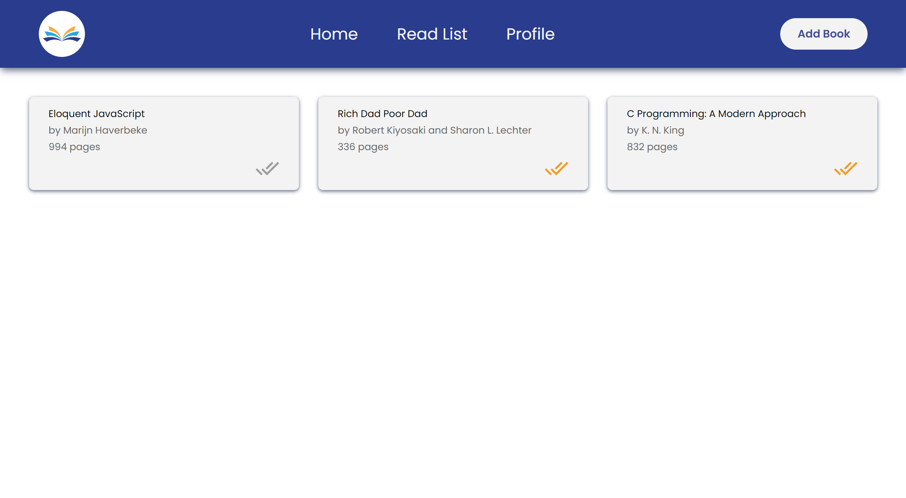

# odin-library

A library website to demonstrate my knowledge on the JavaScript Constructor design pattern &amp; Prototypal Inheritance.

This project tested my skills in Object-Oriented Programming and DOM Methods. This project was also the first time I integrated ESLint & Prettier into my workflows.

I realized that using ESLint and Prettier are great for enforcing code formatting and styles, but it may not be the best choice for small projects like these. They can quickly become crutches when not used properly. A lot of setup had to be done in the initial project development, so I plan to find a way to automate or optimize that process so that I can easily add ESLint and Prettier to my projects without much hassle. Perhaps I could make a Python script or maybe there's already an npm Module that can do that, but otherwise, I plan to find my own way to do so.

My favorite code snippet this time was my self-formulated code to emulate card lift shadow physics, utilizing the `transition: <time>` and `transform: effect` properties of CSS.

```CSS
.main__card {
  background-color: var(--surface);
  box-shadow: 0 2px 6px var(--shadow);
  transition: 0.1s ease-out;
}

.main__card:hover {
  transform: scale(1.025);
  transition: all 0.1s ease-in-out;
  box-shadow: 0 4px 10px rgb(137, 142, 170);
}
```

It was also my first time to use the `filter: blur()` property in order to unfocus UI elements while letting another element take the spotlight.

```CSS
filter: blur(5px);
```

I need to improve on:
- manipulating the DOM in conjunction with JavaScript Object Arrays
- coupling Arrays to DOM Elements
- making clean, modular JavaScript code

# Output
### [Visit the Website Here](https://luzefiru.github.io/odin-library/)


# Requirements
These were the requirements in The Odin Project's [Project: Library](https://www.theodinproject.com/lessons/node-path-javascript-library) site to serve as project specifications. Website aesthetic choices and implementation solely depended on me, the programmer.
